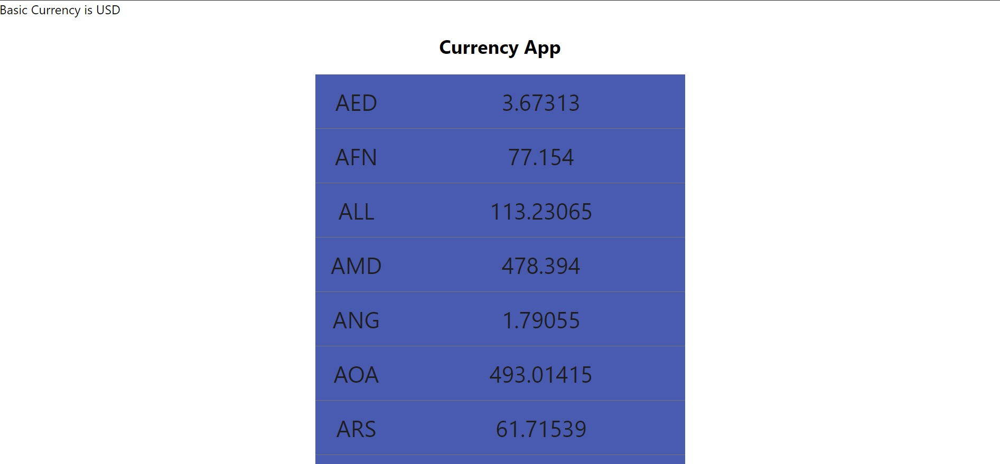

# REACT-CURRENCY-APP

REACT-CURRENCY is a simple currency information engine made with ReactJS and powered by [Currency] API.

### Demo

---

1.  **Home page**
    

### Installation

If you want to continue codding:

1. Clone the repo: `git clone https://github.com/valerasamoylov/react-currency-app.git`
2. Select a directory: `cd react-currency-app`
3. Install packages: `npm install`
4. Launch project: `npm start`

[Currency]: https://currencyapi.net/
